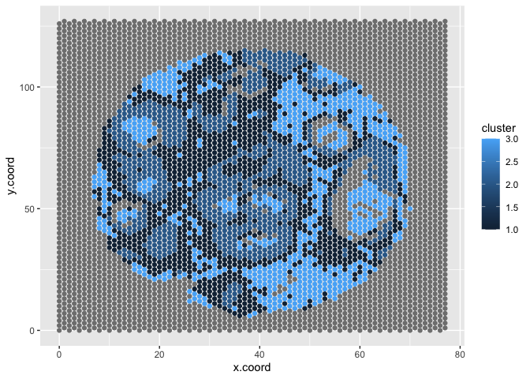
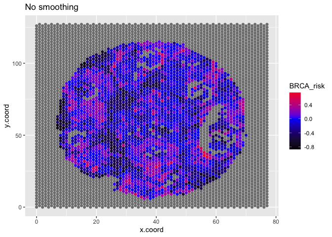
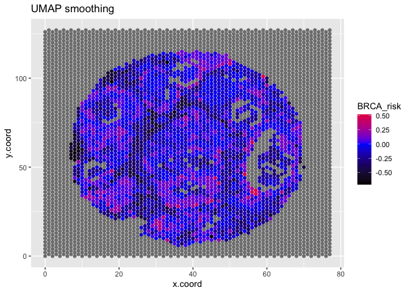
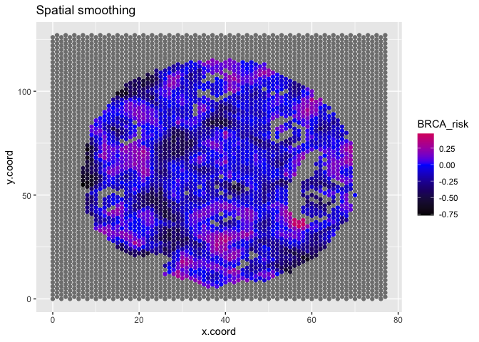
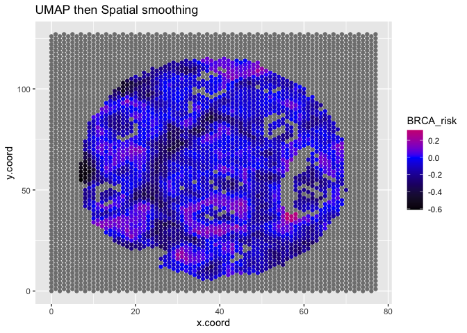
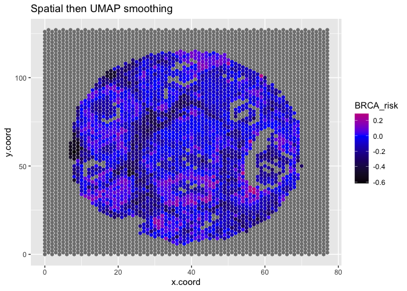
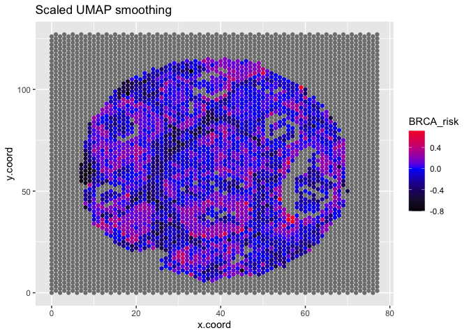
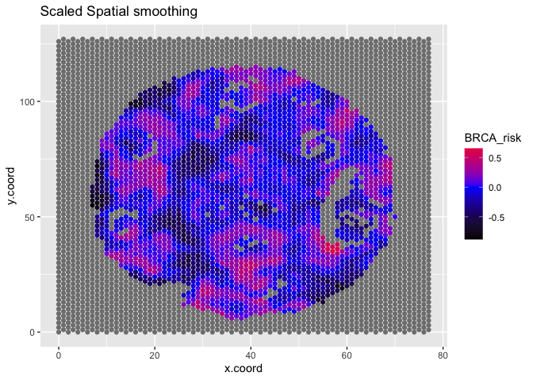
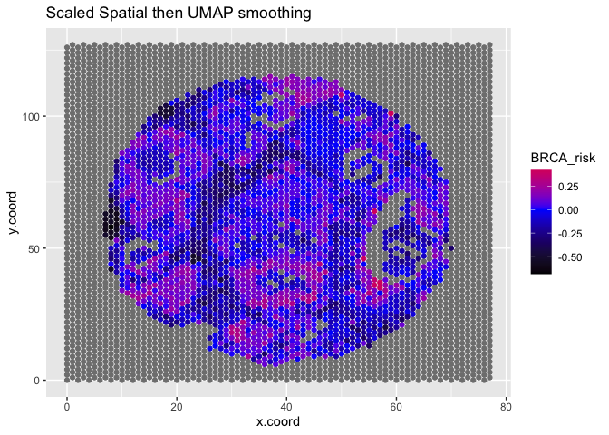

# Running DEGAS on ST data

## Loading required packages and functions

    library(Matrix)
    library(ggplot2)
    library(DEGAS)

    selectFeats <- function(expression,features,selection_statistic)
    {
      original_feats = row.names(expression)
      row.names(expression) = 1:dim(expression)[1]
      dup_feat_uniq = unique(features[duplicated(features)])
      message(length(dup_feat_uniq))
      if(length(dup_feat_uniq)>0){
        dup_feat = features[features %in% dup_feat_uniq]
        dup_feat_idx = which(features %in% dup_feat_uniq)
        rem_feat_idx = c()
        for(feat in dup_feat){
          feat_rowSums = apply(expression[dup_feat_idx[dup_feat==feat],],1,eval(parse(text=selection_statistic)))
          max_feat_idx = which(feat_rowSums==max(feat_rowSums))[1]
          rem_feat_idx = c(rem_feat_idx,as.numeric(names(feat_rowSums)[-max_feat_idx]))
        }
        expression = expression[-rem_feat_idx,]
        row.names(expression) = features[-rem_feat_idx]
        feat_df <- data.frame(new_feature=row.names(expression),original_feature=original_feats[-rem_feat_idx])
        row.names(feat_df) <- feat_df$new_feature
        return(list(expression,feat_df))
      }else{
        row.names(expression) = features
        feat_df <- data.frame(new_feature=row.names(expression),original_feature=original_feats[-rem_feat_idx])
        row.names(feat_df) <- feat_df$new_feature
        return(list(expression,feat_df))
      }
    }

## Loading 10X ST data

    st_counts = readMM(file="filtered_feature_bc_matrix/matrix.mtx.gz")
    st_features = read.table(file="filtered_feature_bc_matrix/features.tsv.gz")
    st_barcodes = read.table(file="filtered_feature_bc_matrix/barcodes.tsv.gz")
    rownames(st_counts) = st_features$V1
    colnames(st_counts) = st_barcodes$V1
    st_tmp = selectFeats(st_counts,st_features$V2,"sum")

    ## 2

    st_counts = st_tmp[[1]]
    rm(st_tmp,st_barcodes,st_features)
    st_meta_locs = read.csv(file="spatial/tissue_positions_list.csv",row.names=1,header=FALSE)
    colnames(st_meta_locs) = c("tissue","x.coord","y.coord","x.pixel","y.pixel")
    st_meta_umap = read.csv(file="analysis/umap/2_components/projection.csv",row.names=1)
    st_meta_clusters = read.csv(file="analysis/clustering/kmeans_3_clusters/clusters.csv",row.names=1)
    st_meta = cbind(st_meta_locs,st_meta_umap[rownames(st_meta_locs),])
    st_meta$cluster = st_meta_clusters[rownames(st_meta),"Cluster"]
    rm(st_meta_locs,st_meta_umap,st_meta_clusters)
    ggplot(st_meta,aes(x=x.coord,y=y.coord,color=cluster)) + geom_point()

## Loading TCGA RNA-seq data

    pt_counts = read.table(file="gdac.broadinstitute.org_BRCA.Merge_rnaseqv2__illuminahiseq_rnaseqv2__unc_edu__Level_3__RSEM_genes_normalized__data.Level_3.2016012800.0.0/BRCA.rnaseqv2__illuminahiseq_rnaseqv2__unc_edu__Level_3__RSEM_genes_normalized__data.data.txt",sep="\t")
    colnames(pt_counts) = pt_counts[1,]
    pt_counts = pt_counts[-c(1,2),]
    rownames(pt_counts) = pt_counts$`Hybridization REF`
    pt_counts$`Hybridization REF` = NULL
    pt_features = sub("[|].*","",rownames(pt_counts))
    pt_counts = pt_counts[pt_features!="?",]
    pt_features = sub("[|].*","",rownames(pt_counts))
    pt_counts = apply(pt_counts,2,as.numeric)
    pt_tmp = selectFeats(as.data.frame(pt_counts),pt_features,"sum")

    ## 1

    pt_counts = pt_tmp[[1]]
    rm(pt_tmp,pt_features)
    pt_sample_type = substring(colnames(pt_counts),14,16)
    pt_counts = pt_counts[,pt_sample_type%in%c("01A","11A")]
    pt_sample_type = substring(colnames(pt_counts),14,16)

## Selecting features

    st_prcnonzero = rowSums(st_counts>0)/dim(st_counts)[2]
    st_vars = apply(st_counts,1,var)
    st_counts = st_counts[st_prcnonzero>0.25 & st_vars > quantile(st_vars,0.9),]
    st_counts = as.data.frame(as.matrix(st_counts))

    pt_vars = apply(pt_counts,1,var)
    pt_counts = pt_counts[pt_vars > quantile(pt_vars,0.9),]

    final_features = intersect(rownames(pt_counts),rownames(st_counts))

## Running DEGAS

    # Preprocessing data (log, normalization, scale)
    stDat = preprocessCounts(st_counts[final_features,])
    stLab = toOneHot(st_meta$cluster[st_meta$tissue==1])
    patDat = preprocessCounts(pt_counts[final_features,])
    patLab = toOneHot(ifelse(pt_sample_type=="01A","tumor","normal"))

    # Training DEGAS model
    initDEGAS()
    tmpDir = 'tmp/'
    set_seed_term(2)
    DEGAS.model = runCCMTLBag(stDat,stLab,patDat,patLab,tmpDir,'ClassClass','DenseNet',3,5)

    ## 3-layer DenseNet ClassClass DEGAS model

    ## 0

    ## 3-layer DenseNet ClassClass DEGAS model

    ## 0

    ## 3-layer DenseNet ClassClass DEGAS model

    ## 0

    ## 3-layer DenseNet ClassClass DEGAS model

    ## 0

    ## 3-layer DenseNet ClassClass DEGAS model

    ## 0

    stpatPreds = predClassBag(DEGAS.model,stDat,"pat")
    st_meta$T2B = rep(NA,dim(st_meta)[1])

## Visualizing Tumor risk

### Without scaling

    st_meta[colnames(st_counts),"BRCA"] = toCorrCoeff(stpatPreds[,1])
    st_meta[colnames(st_counts),"BRCA_umap"] = knnSmooth(as.numeric(st_meta[colnames(st_counts),"BRCA"]),as.matrix(st_meta[colnames(st_counts),c("UMAP.1","UMAP.2")]))
    st_meta[colnames(st_counts),"BRCA_spatial"] = knnSmooth(as.numeric(st_meta[colnames(st_counts),"BRCA"]),as.matrix(st_meta[colnames(st_counts),c("x.coord","y.coord")]))
    st_meta[colnames(st_counts),"BRCA_umap_spatial"] = knnSmooth(as.numeric(st_meta[colnames(st_counts),"BRCA_umap"]),as.matrix(st_meta[colnames(st_counts),c("x.coord","y.coord")]))
    st_meta[colnames(st_counts),"BRCA_spatial_umap"] = knnSmooth(as.numeric(st_meta[colnames(st_counts),"BRCA_spatial"]),as.matrix(st_meta[colnames(st_counts),c("UMAP.1","UMAP.2")]))
    knitr::include_graphics("tissue_lowres_image.png")

    ggplot(st_meta,aes(x=x.coord,y=y.coord,color=BRCA)) + geom_point() + scale_color_gradient2(low = "black",mid="blue",high="red",name="BRCA_risk") + ggtitle("No smoothing")

    ggplot(st_meta,aes(x=x.coord,y=y.coord,color=BRCA_umap)) + geom_point() + scale_color_gradient2(low = "black",mid="blue",high="red",name="BRCA_risk") + ggtitle("UMAP smoothing")

    ggplot(st_meta,aes(x=x.coord,y=y.coord,color=BRCA_spatial)) + geom_point() + scale_color_gradient2(low = "black",mid="blue",high="red",name="BRCA_risk") + ggtitle("Spatial smoothing")

    ggplot(st_meta,aes(x=x.coord,y=y.coord,color=BRCA_umap_spatial)) + geom_point() + scale_color_gradient2(low = "black",mid="blue",high="red",name="BRCA_risk") + ggtitle("UMAP then Spatial smoothing")

    ggplot(st_meta,aes(x=x.coord,y=y.coord,color=BRCA_spatial_umap)) + geom_point() + scale_color_gradient2(low = "black",mid="blue",high="red",name="BRCA_risk") + ggtitle("Spatial then UMAP smoothing")

### With scaling

    st_meta[colnames(st_counts),"BRCA_scaled"] = toCorrCoeff(scaleFunc(stpatPreds[,1]))
    st_meta[colnames(st_counts),"BRCA_scaled_umap"] = knnSmooth(as.numeric(st_meta[colnames(st_counts),"BRCA_scaled"]),as.matrix(st_meta[colnames(st_counts),c("UMAP.1","UMAP.2")]))
    st_meta[colnames(st_counts),"BRCA_scaled_spatial"] = knnSmooth(as.numeric(st_meta[colnames(st_counts),"BRCA_scaled"]),as.matrix(st_meta[colnames(st_counts),c("x.coord","y.coord")]))
    st_meta[colnames(st_counts),"BRCA_scaled_umap_spatial"] = knnSmooth(as.numeric(st_meta[colnames(st_counts),"BRCA_scaled_umap"]),as.matrix(st_meta[colnames(st_counts),c("x.coord","y.coord")]))
    st_meta[colnames(st_counts),"BRCA_scaled_spatial_umap"] = knnSmooth(as.numeric(st_meta[colnames(st_counts),"BRCA_scaled_spatial"]),as.matrix(st_meta[colnames(st_counts),c("UMAP.1","UMAP.2")]))
    knitr::include_graphics("tissue_lowres_image.png")

    ggplot(st_meta,aes(x=x.coord,y=y.coord,color=BRCA_scaled)) + geom_point() + scale_color_gradient2(low = "black",mid="blue",high="red",name="BRCA_risk") + ggtitle("Scaled no smoothing")

    ggplot(st_meta,aes(x=x.coord,y=y.coord,color=BRCA_scaled_umap)) + geom_point() + scale_color_gradient2(low = "black",mid="blue",high="red",name="BRCA_risk") + ggtitle("Scaled UMAP smoothing")

    ggplot(st_meta,aes(x=x.coord,y=y.coord,color=BRCA_scaled_spatial)) + geom_point() + scale_color_gradient2(low = "black",mid="blue",high="red",name="BRCA_risk") + ggtitle("Scaled Spatial smoothing")

    ggplot(st_meta,aes(x=x.coord,y=y.coord,color=BRCA_scaled_umap_spatial)) + geom_point() + scale_color_gradient2(low = "black",mid="blue",high="red",name="BRCA_risk") + ggtitle("Scaled UMAP then Spatial smoothing")

    ggplot(st_meta,aes(x=x.coord,y=y.coord,color=BRCA_scaled_spatial_umap)) + geom_point() + scale_color_gradient2(low = "black",mid="blue",high="red",name="BRCA_risk") + ggtitle("Scaled Spatial then UMAP smoothing")

## Printing session info

    sessionInfo()

    ## R version 4.1.1 (2021-08-10)
    ## Platform: x86_64-apple-darwin17.0 (64-bit)
    ## Running under: macOS Catalina 10.15.7
    ## 
    ## Matrix products: default
    ## BLAS:   /Library/Frameworks/R.framework/Versions/4.1/Resources/lib/libRblas.0.dylib
    ## LAPACK: /Library/Frameworks/R.framework/Versions/4.1/Resources/lib/libRlapack.dylib
    ## 
    ## locale:
    ## [1] en_US.UTF-8/en_US.UTF-8/en_US.UTF-8/C/en_US.UTF-8/en_US.UTF-8
    ## 
    ## attached base packages:
    ## [1] stats     graphics  grDevices utils     datasets  methods   base     
    ## 
    ## other attached packages:
    ## [1] DEGAS_0.1.0   ggplot2_3.3.5 Matrix_1.3-4 
    ## 
    ## loaded via a namespace (and not attached):
    ##  [1] highr_0.9        pillar_1.6.4     compiler_4.1.1   tools_4.1.1     
    ##  [5] digest_0.6.28    evaluate_0.14    lifecycle_1.0.1  tibble_3.1.5    
    ##  [9] gtable_0.3.0     lattice_0.20-45  png_0.1-7        pkgconfig_2.0.3 
    ## [13] rlang_0.4.12     DBI_1.1.1        yaml_2.2.1       xfun_0.27       
    ## [17] fastmap_1.1.0    withr_2.4.2      stringr_1.4.0    dplyr_1.0.7     
    ## [21] knitr_1.36       generics_0.1.0   vctrs_0.3.8      grid_4.1.1      
    ## [25] tidyselect_1.1.1 glue_1.4.2       R6_2.5.1         fansi_0.5.0     
    ## [29] rmarkdown_2.11   farver_2.1.0     purrr_0.3.4      magrittr_2.0.1  
    ## [33] scales_1.1.1     ellipsis_0.3.2   htmltools_0.5.2  assertthat_0.2.1
    ## [37] colorspace_2.0-2 labeling_0.4.2   utf8_1.2.2       stringi_1.7.5   
    ## [41] munsell_0.5.0    crayon_1.4.1
