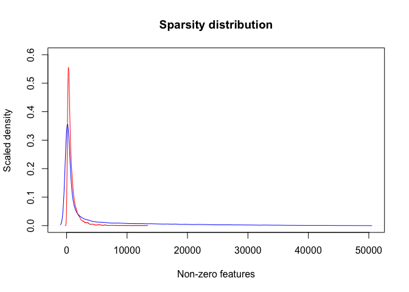
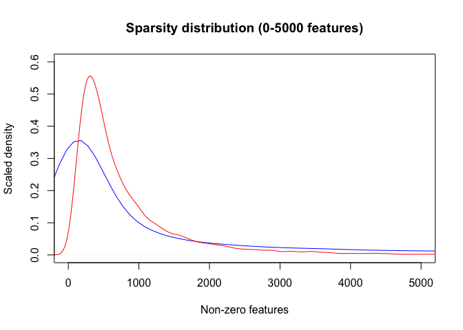
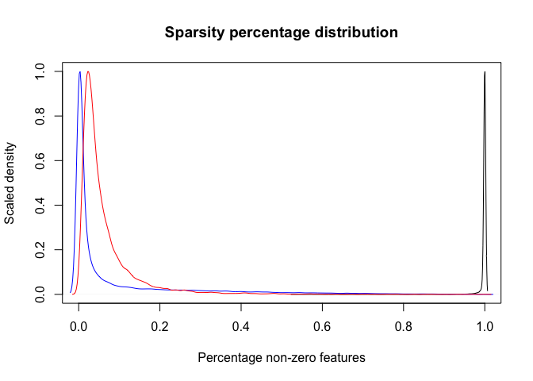
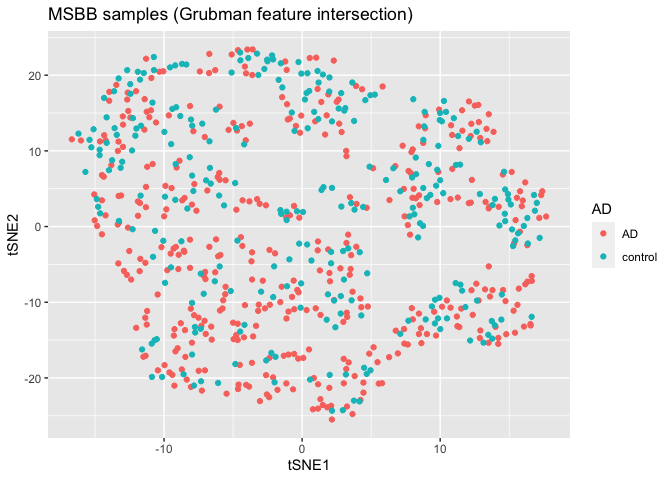
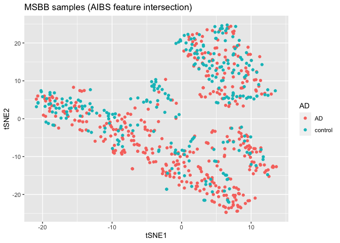
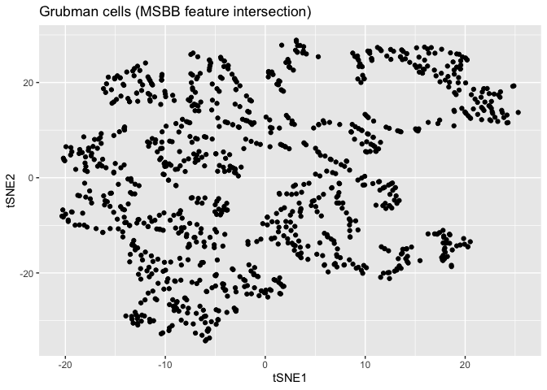
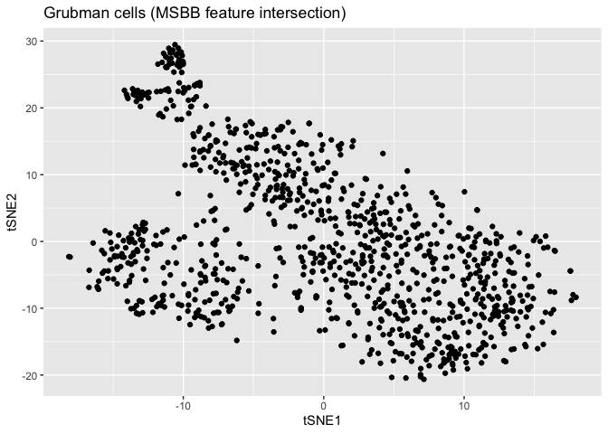

# Load required packages

    library(DEGAS)
    library(Rtsne)

    ## Warning: package 'Rtsne' was built under R version 4.0.2

    library(ggplot2)

    ## Warning: package 'ggplot2' was built under R version 4.0.2

    library(ggVennDiagram)

    ## Warning: package 'ggVennDiagram' was built under R version 4.0.2

    library(Matrix)

    ## Warning: package 'Matrix' was built under R version 4.0.2

    library(glmnet)

    ## Warning: package 'glmnet' was built under R version 4.0.2

    ## Loaded glmnet 4.1-2

# Load data

    msbb_raw = read.csv("~/Desktop/DEGAS/Feature_selection_example/msbb_data.csv",row.names=1)
    grub_raw = read.csv("~/Desktop/DEGAS/Feature_selection_example/grubman_data.csv",row.names=1)
    aibs_raw = readMM("~/Desktop/DEGAS/Feature_selection_example/aibs_data.mtx")
    rnames = read.csv("~/Desktop/DEGAS/Feature_selection_example/aibs_row.csv",row.names=1)
    cnames = read.csv("~/Desktop/DEGAS/Feature_selection_example/aibs_col.csv",row.names=1)
    colnames(aibs_raw) = cnames[,1]
    rownames(aibs_raw) = rnames[,1]

# Calculating nonzero percentage (i.e. sparsity)

    msbb_gene_nonzero = rowSums(msbb_raw>0)
    msbb_gene_nonzero_prc = msbb_gene_nonzero/dim(msbb_raw)[2]
    aibs_gene_nonzero = rowSums(aibs_raw>0)
    aibs_gene_nonzero_prc = aibs_gene_nonzero/dim(aibs_raw)[2]
    grub_gene_nonzero = rowSums(grub_raw>0)
    grub_gene_nonzero_prc = grub_gene_nonzero/dim(grub_raw)[2]

# Comparing gene sparsity of different datasets

### Line colors are: MSBB (black), AIBS (blue), and Grubman (red)

    aibs_nonzero_density = density(aibs_gene_nonzero)
    aibs_nonzero_density$y = scaleFunc(aibs_nonzero_density$y)
    grub_nonzero_density = density(grub_gene_nonzero)
    grub_nonzero_density$y = scaleFunc(grub_nonzero_density$y)
    plot(aibs_nonzero_density,col="blue",ylim=c(0,0.6),xlab="Non-zero features",
         ylab="Scaled density",main="Sparsity distribution")
    lines(grub_nonzero_density,col="red")

    plot(aibs_nonzero_density,col="blue",ylim=c(0,0.6),xlim=c(0,5000),xlab="Non-zero features",
         ylab="Scaled density",main="Sparsity distribution (0-5000 features)")
    lines(grub_nonzero_density,col="red")

    msbb_nonzero_prc_density = density(msbb_gene_nonzero_prc)
    msbb_nonzero_prc_density$y = scaleFunc(msbb_nonzero_prc_density$y)
    aibs_nonzero_prc_density = density(aibs_gene_nonzero_prc)
    aibs_nonzero_prc_density$y = scaleFunc(aibs_nonzero_prc_density$y)
    grub_nonzero_prc_density = density(grub_gene_nonzero_prc)
    grub_nonzero_prc_density$y = scaleFunc(grub_nonzero_prc_density$y)
    plot(msbb_nonzero_prc_density,col="black",xlim=c(0,1),xlab="Percentage non-zero features",
         ylab="Scaled density",main="Sparsity percentage distribution")
    lines(aibs_nonzero_prc_density,col="blue")
    lines(grub_nonzero_prc_density,col="red")

\# Calculating gene log2 variance \#\#\# (a rough indicator of
biological signal for a given gene)

    msbb_gene_logvar = log2(apply(msbb_raw,1,var)+1)
    aibs_gene_logvar = log2(apply(aibs_raw,1,var)+1)
    grub_gene_logvar = log2(apply(grub_raw,1,var)+1)

# Comparing gene variances of different datasets

### Line colors are: MSBB (black), AIBS (blue), and Grubman (red)

    msbb_logvar_density = density(msbb_gene_logvar)
    msbb_logvar_density$y = scaleFunc(msbb_logvar_density$y)
    aibs_logvar_density = density(aibs_gene_logvar)
    aibs_logvar_density$y = scaleFunc(aibs_logvar_density$y)
    grub_logvar_density = density(grub_gene_logvar)
    grub_logvar_density$y = scaleFunc(grub_logvar_density$y)
    plot(msbb_logvar_density,col="black",xlim=c(0,40),xlab="Log2 variance",
         ylab="Scaled density",main="Variance distributions")
    lines(aibs_logvar_density,col="blue")
    lines(grub_logvar_density,col="red")

\# Feature selection examples \#\# Let’s use the same cutoffs for each
dataset \#\#\# We will get very different numbers of features even with
the same cutoffs

    msbb_feats = names(msbb_gene_nonzero_prc)[msbb_gene_nonzero_prc>0.5]
    msbb_feats = names(msbb_gene_logvar[msbb_feats])[msbb_gene_logvar[msbb_feats] > quantile(msbb_gene_logvar[msbb_feats],0.9)]
    aibs_feats = names(aibs_gene_nonzero_prc)[aibs_gene_nonzero_prc>0.5]
    aibs_feats = names(aibs_gene_logvar[aibs_feats])[aibs_gene_logvar[aibs_feats] > quantile(aibs_gene_logvar[aibs_feats],0.9)]
    grub_feats = names(grub_gene_nonzero_prc)[grub_gene_nonzero_prc>0.5]
    grub_feats = names(grub_gene_logvar[grub_feats])[grub_gene_logvar[grub_feats] > quantile(grub_gene_logvar[grub_feats],0.9)]
    ggVennDiagram(list(Grubman=grub_feats,MSBB=msbb_feats))+scale_fill_gradient(low="white",high="red")

    ggVennDiagram(list(AIBS=aibs_feats,MSBB=msbb_feats))+scale_fill_gradient(low="white",high="red")

## Clustering the patient samples and single cells (same cutoffs)

### The Grubman exeriments have much less structure in the tSNE plot

    set.seed(1)
    msbb_grubfeat_tsne = Rtsne(log2(t(msbb_raw[intersect(grub_feats,msbb_feats),])+1))
    msbb_grubfeat_df = data.frame(tSNE1 = msbb_grubfeat_tsne$Y[,1], tSNE2 = msbb_grubfeat_tsne$Y[,2], AD = sub("[_].*","",colnames(msbb_raw)))
    p1 = ggplot(msbb_grubfeat_df,aes(x=tSNE1,y=tSNE2,group=AD,color=AD)) + geom_point() + ggtitle("MSBB samples (Grubman feature intersection)")
    plot(ggExtra::ggMarginal(p1,groupColour=TRUE,groupFill = TRUE))

    cv.fit = cv.glmnet(log2(t(msbb_raw[intersect(grub_feats,msbb_feats),])+1),ifelse(msbb_grubfeat_df$AD=="AD",1,0),lambda=c(1e-15,1e-16))
    message(paste0("MSBB CV error (Grubman feature intersection): ",round(min(cv.fit$cvm),4)))

    ## MSBB CV error (Grubman feature intersection): 0.2324

    set.seed(1)
    msbb_aibsfeat_tsne = Rtsne(log2(t(msbb_raw[intersect(aibs_feats,msbb_feats),])+1))
    msbb_aibsfeat_df = data.frame(tSNE1 = msbb_aibsfeat_tsne$Y[,1], tSNE2 = msbb_aibsfeat_tsne$Y[,2], AD = sub("[_].*","",colnames(msbb_raw)))
    p2 = ggplot(msbb_aibsfeat_df,aes(x=tSNE1,y=tSNE2,group=AD,color=AD)) + geom_point() + ggtitle("MSBB samples (AIBS feature intersection)")
    plot(ggExtra::ggMarginal(p2,groupColour=TRUE,groupFill = TRUE))

    cv.fit = cv.glmnet(log2(t(msbb_raw[intersect(aibs_feats,msbb_feats),])+1),ifelse(msbb_aibsfeat_df$AD=="AD",1,0),lambda=c(1e-15,1e-16))
    message(paste0("MSBB CV error (AIBS feature intersection): ",round(min(cv.fit$cvm),4)))

    ## MSBB CV error (AIBS feature intersection): 0.1746

    set.seed(1)
    grub_samp = sample(1:dim(grub_raw)[2],1000)
    set.seed(1)
    grub_msbbfeat_tsne = Rtsne(log2(t(grub_raw[intersect(grub_feats,msbb_feats),grub_samp])+1),check_duplicates = FALSE)
    grub_msbbfeat_df = data.frame(tSNE1 = grub_msbbfeat_tsne$Y[,1], tSNE2 = grub_msbbfeat_tsne$Y[,2])
    p3 = ggplot(grub_msbbfeat_df,aes(x=tSNE1,y=tSNE2)) + geom_point() + ggtitle("Grubman cells (MSBB feature intersection)")
    plot(ggExtra::ggMarginal(p3))

    set.seed(1)
    aibs_samp = sample(1:dim(aibs_raw)[2],1000)
    set.seed(1)
    aibs_msbbfeat_tsne = Rtsne(log2(t(as.matrix(aibs_raw[intersect(aibs_feats,msbb_feats),aibs_samp]))+1),check_duplicates = FALSE)
    aibs_msbbfeat_df = data.frame(tSNE1 = aibs_msbbfeat_tsne$Y[,1], tSNE2 = aibs_msbbfeat_tsne$Y[,2])
    p4 = ggplot(aibs_msbbfeat_df,aes(x=tSNE1,y=tSNE2)) + geom_point() + ggtitle("Grubman cells (MSBB feature intersection)")
    plot(ggExtra::ggMarginal(p4))

## Let’s use a looser cutoff for the more sparse grubman dataset

### There will be more usable features in the grubman dataset

    msbb_feats = names(msbb_gene_nonzero_prc)[msbb_gene_nonzero_prc>0.5]
    msbb_feats = names(msbb_gene_logvar[msbb_feats])[msbb_gene_logvar[msbb_feats] > quantile(msbb_gene_logvar[msbb_feats],0.9)]
    aibs_feats = names(aibs_gene_nonzero_prc)[aibs_gene_nonzero_prc>0.5]
    aibs_feats = names(aibs_gene_logvar[aibs_feats])[aibs_gene_logvar[aibs_feats] > quantile(aibs_gene_logvar[aibs_feats],0.9)]
    grub_feats = names(grub_gene_nonzero_prc)[grub_gene_nonzero_prc>0.2]
    grub_feats = names(grub_gene_logvar[grub_feats])[grub_gene_logvar[grub_feats] > quantile(grub_gene_logvar[grub_feats],0.5)]
    ggVennDiagram(list(Grubman=grub_feats,MSBB=msbb_feats))+scale_fill_gradient(low="white",high="red")

    ggVennDiagram(list(AIBS=aibs_feats,MSBB=msbb_feats))+scale_fill_gradient(low="white",high="red")

## Clustering the patient samples and single cells (Grubman cutoff loosened)

### The Grubman exeriments have more structure in the tSNE plots

    set.seed(1)
    msbb_grubfeat_tsne = Rtsne(log2(t(msbb_raw[intersect(grub_feats,msbb_feats),])+1))
    msbb_grubfeat_df = data.frame(tSNE1 = msbb_grubfeat_tsne$Y[,1], tSNE2 = msbb_grubfeat_tsne$Y[,2], AD = sub("[_].*","",colnames(msbb_raw)))
    p1 = ggplot(msbb_grubfeat_df,aes(x=tSNE1,y=tSNE2,group=AD,color=AD)) + geom_point() + ggtitle("MSBB samples (Grubman feature intersection)")
    plot(ggExtra::ggMarginal(p1,groupColour=TRUE,groupFill = TRUE))

    cv.fit = cv.glmnet(log2(t(msbb_raw[intersect(grub_feats,msbb_feats),])+1),ifelse(msbb_grubfeat_df$AD=="AD",1,0),lambda=c(1e-15,1e-16))
    message(paste0("MSBB CV error (Grubman feature intersection): ",round(min(cv.fit$cvm),4)))

    ## MSBB CV error (Grubman feature intersection): 0.1476

    set.seed(1)
    msbb_aibsfeat_tsne = Rtsne(log2(t(msbb_raw[intersect(aibs_feats,msbb_feats),])+1))
    msbb_aibsfeat_df = data.frame(tSNE1 = msbb_aibsfeat_tsne$Y[,1], tSNE2 = msbb_aibsfeat_tsne$Y[,2], AD = sub("[_].*","",colnames(msbb_raw)))
    p2 = ggplot(msbb_aibsfeat_df,aes(x=tSNE1,y=tSNE2,group=AD,color=AD)) + geom_point() + ggtitle("MSBB samples (AIBS feature intersection)")
    plot(ggExtra::ggMarginal(p2,groupColour=TRUE,groupFill = TRUE))

    cv.fit = cv.glmnet(log2(t(msbb_raw[intersect(aibs_feats,msbb_feats),])+1),ifelse(msbb_aibsfeat_df$AD=="AD",1,0),lambda=c(1e-15,1e-16))
    message(paste0("MSBB CV error (AIBS feature intersection): ",round(min(cv.fit$cvm),4)))

    ## MSBB CV error (AIBS feature intersection): 0.1746

    set.seed(1)
    grub_samp = sample(1:dim(grub_raw)[2],1000)
    set.seed(1)
    grub_msbbfeat_tsne = Rtsne(log2(t(grub_raw[intersect(grub_feats,msbb_feats),grub_samp])+1),check_duplicates = FALSE)
    grub_msbbfeat_df = data.frame(tSNE1 = grub_msbbfeat_tsne$Y[,1], tSNE2 = grub_msbbfeat_tsne$Y[,2])
    p3 = ggplot(grub_msbbfeat_df,aes(x=tSNE1,y=tSNE2)) + geom_point() + ggtitle("Grubman cells (MSBB feature intersection)")
    plot(ggExtra::ggMarginal(p3))

    set.seed(1)
    aibs_samp = sample(1:dim(aibs_raw)[2],1000)
    set.seed(1)
    aibs_msbbfeat_tsne = Rtsne(log2(t(as.matrix(aibs_raw[intersect(aibs_feats,msbb_feats),aibs_samp]))+1),check_duplicates = FALSE)
    aibs_msbbfeat_df = data.frame(tSNE1 = aibs_msbbfeat_tsne$Y[,1], tSNE2 = aibs_msbbfeat_tsne$Y[,2])
    p4 = ggplot(aibs_msbbfeat_df,aes(x=tSNE1,y=tSNE2)) + geom_point() + ggtitle("Grubman cells (MSBB feature intersection)")
    plot(ggExtra::ggMarginal(p4))

## Let’s use a very loose cutoff for the more sparse grubman dataset

### Now we are retaining a large number of features which may contain noise

    msbb_feats = names(msbb_gene_nonzero_prc)[msbb_gene_nonzero_prc>0.5]
    msbb_feats = names(msbb_gene_logvar[msbb_feats])[msbb_gene_logvar[msbb_feats] > quantile(msbb_gene_logvar[msbb_feats],0.9)]
    aibs_feats = names(aibs_gene_nonzero_prc)[aibs_gene_nonzero_prc>0.5]
    aibs_feats = names(aibs_gene_logvar[aibs_feats])[aibs_gene_logvar[aibs_feats] > quantile(aibs_gene_logvar[aibs_feats],0.9)]
    grub_feats = names(grub_gene_nonzero_prc)[grub_gene_nonzero_prc>0.1]
    grub_feats = names(grub_gene_logvar[grub_feats])[grub_gene_logvar[grub_feats] > quantile(grub_gene_logvar[grub_feats],0.5)]
    ggVennDiagram(list(Grubman=grub_feats,MSBB=msbb_feats))+scale_fill_gradient(low="white",high="red")

    ggVennDiagram(list(AIBS=aibs_feats,MSBB=msbb_feats))+scale_fill_gradient(low="white",high="red")

## Clustering the patient samples and single cells (Grubman cutoff loosened)

### The Grubman exeriments have more structure in the tSNE plots

### Here we see that the performance declines using the Grubman features

    set.seed(1)
    msbb_grubfeat_tsne = Rtsne(log2(t(msbb_raw[intersect(grub_feats,msbb_feats),])+1))
    msbb_grubfeat_df = data.frame(tSNE1 = msbb_grubfeat_tsne$Y[,1], tSNE2 = msbb_grubfeat_tsne$Y[,2], AD = sub("[_].*","",colnames(msbb_raw)))
    p1 = ggplot(msbb_grubfeat_df,aes(x=tSNE1,y=tSNE2,group=AD,color=AD)) + geom_point() + ggtitle("MSBB samples (Grubman feature intersection)")
    plot(ggExtra::ggMarginal(p1,groupColour=TRUE,groupFill = TRUE))

    cv.fit = cv.glmnet(log2(t(msbb_raw[intersect(grub_feats,msbb_feats),])+1),ifelse(msbb_grubfeat_df$AD=="AD",1,0),lambda=c(1e-15,1e-16))
    message(paste0("MSBB CV error (Grubman feature intersection): ",round(min(cv.fit$cvm),4)))

    ## MSBB CV error (Grubman feature intersection): 0.263

    set.seed(1)
    msbb_aibsfeat_tsne = Rtsne(log2(t(msbb_raw[intersect(aibs_feats,msbb_feats),])+1))
    msbb_aibsfeat_df = data.frame(tSNE1 = msbb_aibsfeat_tsne$Y[,1], tSNE2 = msbb_aibsfeat_tsne$Y[,2], AD = sub("[_].*","",colnames(msbb_raw)))
    p2 = ggplot(msbb_aibsfeat_df,aes(x=tSNE1,y=tSNE2,group=AD,color=AD)) + geom_point() + ggtitle("MSBB samples (AIBS feature intersection)")
    plot(ggExtra::ggMarginal(p2,groupColour=TRUE,groupFill = TRUE))

    cv.fit = cv.glmnet(log2(t(msbb_raw[intersect(aibs_feats,msbb_feats),])+1),ifelse(msbb_aibsfeat_df$AD=="AD",1,0),lambda=c(1e-15,1e-16))
    message(paste0("MSBB CV error (AIBS feature intersection): ",round(min(cv.fit$cvm),4)))

    ## MSBB CV error (AIBS feature intersection): 0.1746

    set.seed(1)
    grub_samp = sample(1:dim(grub_raw)[2],1000)
    set.seed(1)
    grub_msbbfeat_tsne = Rtsne(log2(t(grub_raw[intersect(grub_feats,msbb_feats),grub_samp])+1),check_duplicates = FALSE)
    grub_msbbfeat_df = data.frame(tSNE1 = grub_msbbfeat_tsne$Y[,1], tSNE2 = grub_msbbfeat_tsne$Y[,2])
    p3 = ggplot(grub_msbbfeat_df,aes(x=tSNE1,y=tSNE2)) + geom_point() + ggtitle("Grubman cells (MSBB feature intersection)")
    plot(ggExtra::ggMarginal(p3))

    set.seed(1)
    aibs_samp = sample(1:dim(aibs_raw)[2],1000)
    set.seed(1)
    aibs_msbbfeat_tsne = Rtsne(log2(t(as.matrix(aibs_raw[intersect(aibs_feats,msbb_feats),aibs_samp]))+1),check_duplicates = FALSE)
    aibs_msbbfeat_df = data.frame(tSNE1 = aibs_msbbfeat_tsne$Y[,1], tSNE2 = aibs_msbbfeat_tsne$Y[,2])
    p4 = ggplot(aibs_msbbfeat_df,aes(x=tSNE1,y=tSNE2)) + geom_point() + ggtitle("Grubman cells (MSBB feature intersection)")
    plot(ggExtra::ggMarginal(p4))

# Session Info

    sessionInfo()

    ## R version 4.0.1 (2020-06-06)
    ## Platform: x86_64-apple-darwin17.0 (64-bit)
    ## Running under: macOS Catalina 10.15.7
    ## 
    ## Matrix products: default
    ## BLAS:   /Library/Frameworks/R.framework/Versions/4.0/Resources/lib/libRblas.dylib
    ## LAPACK: /Library/Frameworks/R.framework/Versions/4.0/Resources/lib/libRlapack.dylib
    ## 
    ## locale:
    ## [1] en_US.UTF-8/en_US.UTF-8/en_US.UTF-8/C/en_US.UTF-8/en_US.UTF-8
    ## 
    ## attached base packages:
    ## [1] stats     graphics  grDevices utils     datasets  methods   base     
    ## 
    ## other attached packages:
    ## [1] glmnet_4.1-2        Matrix_1.3-4        ggVennDiagram_1.1.4
    ## [4] ggplot2_3.3.5       Rtsne_0.15          DEGAS_0.1.0        
    ## 
    ## loaded via a namespace (and not attached):
    ##  [1] shape_1.4.6        tidyselect_1.1.1   xfun_0.25          purrr_0.3.4       
    ##  [5] sf_1.0-2           splines_4.0.1      lattice_0.20-41    colorspace_2.0-2  
    ##  [9] vctrs_0.3.8        generics_0.1.0     miniUI_0.1.1.1     htmltools_0.5.1.1 
    ## [13] yaml_2.2.1         utf8_1.2.2         survival_3.2-11    rlang_0.4.11      
    ## [17] later_1.2.0        e1071_1.7-8        pillar_1.6.2       RVenn_1.1.0       
    ## [21] glue_1.4.2         withr_2.4.2        DBI_1.1.1          foreach_1.5.1     
    ## [25] lifecycle_1.0.0    stringr_1.4.0      munsell_0.5.0      gtable_0.3.0      
    ## [29] codetools_0.2-18   evaluate_0.14      labeling_0.4.2     knitr_1.33        
    ## [33] fastmap_1.1.0      httpuv_1.6.1       class_7.3-19       fansi_0.5.0       
    ## [37] highr_0.9          Rcpp_1.0.7         xtable_1.8-4       KernSmooth_2.23-20
    ## [41] promises_1.2.0.1   scales_1.1.1       classInt_0.4-3     mime_0.11         
    ## [45] farver_2.1.0       ggExtra_0.9        digest_0.6.27      stringi_1.7.3     
    ## [49] shiny_1.6.0        dplyr_1.0.7        grid_4.0.1         tools_4.0.1       
    ## [53] magrittr_2.0.1     proxy_0.4-26       tibble_3.1.3       crayon_1.4.1      
    ## [57] pkgconfig_2.0.3    ellipsis_0.3.2     assertthat_0.2.1   rmarkdown_2.10    
    ## [61] iterators_1.0.13   R6_2.5.0           units_0.7-2        compiler_4.0.1
