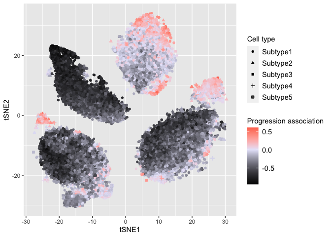

# Load required packages

### Remember to set working directory to the MM\_example directory

    library(DEGAS)
    library(Rtsne)

    ## Warning: package 'Rtsne' was built under R version 4.0.2

    library(ggplot2)

    ## Warning: package 'ggplot2' was built under R version 4.0.2

    # Set working directory to the downloaded directory
    setwd("~/Desktop/DEGAS/MM_example_testing/")

# Load data

    scDat = read.csv('scDat.csv',row.names=1)
    scLab = read.csv('scLab.csv',row.names=1)
    patDat = read.csv('patDat.csv',row.names=1)
    patLab = read.csv('patLab.csv',row.names=1)

# Initialize DEGAS framework

    path.data = ''
    path.result = ''
    initDEGAS()
    tmpDir = paste0(path.result, 'tmp/')

# Training DEGAS model

    ccModel1 = runCCMTLBag(scDat,scLab,patDat,patLab,tmpDir,'ClassCox','DenseNet',3,5)

    ## 0
    ## 0
    ## 0
    ## 0
    ## 0

# Predictions from DEGAS model

    # Predicting patient outcome in cells
    # ie, predicting MM progression association in individual cells
    scpatPreds = predClassBag(ccModel1,scDat,'pat')
    colnames(scpatPreds) = c("Hazard")

# Displaying single cells overlaid with progression association

    # Overlaying progression risk onto unintegrated tSNE plot
    # Set seed and run tSNE
    set.seed(1)
    scDat_tsne = Rtsne(scDat)
    colnames(scDat_tsne$Y) = c('tSNE1','tSNE2')
    # kNN smoothing of MM progression association
    impressions_sc_smooth = knnSmooth(scpatPreds[,"Hazard"],scDat_tsne$Y)
    # Conversion of MM progression association to correlation
    impressions_sc_smooth_cor = toCorrCoeff(impressions_sc_smooth)
    tmp = data.frame(tSNE1=scDat_tsne$Y[,"tSNE1"],tSNE2=scDat_tsne$Y[,"tSNE2"],
                     Dis=impressions_sc_smooth_cor,CT=fromOneHot(scLab))
    p = ggplot(tmp,aes(x=tSNE1,y=tSNE2,color=Dis,shape=CT))+ geom_point() + 
               scale_color_gradient2(low = "black",mid="lavender",high="red")
    plot(p+labs(color='Progression association',shape='Cell type') +
           theme(legend.title=element_text(size=rel(1)),legend.text=element_text(size=rel(1)),
                 axis.title=element_text(size=rel(1)),axis.text.x=element_text(size=rel(1)),
                 axis.text.y=element_text(size=rel(1))))

    # Overlaying progression risk onto integrated tSNE plot from Seurat
    integ_tsne_coord = read.csv("seurat_integrated_tsne.csv",row.names=1)
    tmp2 = data.frame(tSNE1=integ_tsne_coord$tSNE1,tSNE2=integ_tsne_coord$tSNE2,
                      Dis=toCorrCoeff(knnSmooth(as.numeric(scpatPreds[,"Hazard"]),
                                                as.matrix(integ_tsne_coord[,c("tSNE1","tSNE2")]))),
                      CT=fromOneHot(scLab))
    p = ggplot(tmp2,aes(x=tSNE1,y=tSNE2,color=Dis,shape=CT)) + geom_point() +
               scale_color_gradient2(low = "black",mid="lavender",high="red")
    plot(p+labs(color='Progression association',shape='Cell type') +
           theme(legend.title=element_text(size=rel(1)),legend.text=element_text(size=rel(1)),
                 axis.title=element_text(size=rel(1)),axis.text.x=element_text(size=rel(1)),
                 axis.text.y=element_text(size=rel(1))))

